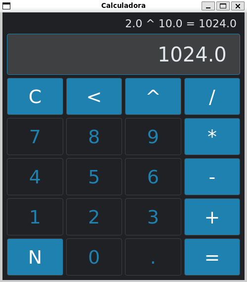

# Calculadora com Interface Gráfica

Esta é uma calculadora simples com interface gráfica desenvolvida usando PySide6.

### Visual

### Visão Geral

Este projeto é uma calculadora básica que permite realizar operações matemáticas simples, como adição, subtração, multiplicação e divisão. A interface gráfica foi criada utilizando o PySide6, que é o binding oficial do Qt para Python.

#

### Funcionalidades
- Adição
- Subtração
- Multiplicação
- Divisão
- Potenciação
- Limpar a tela

